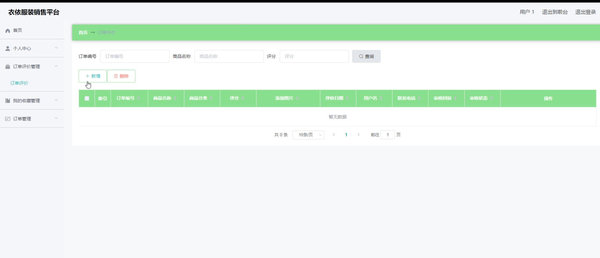

# 基于springboot的衣依服装销售平台

#### 介绍

在现代电子商务蓬勃发展的背景下，服装销售平台的高效管理和用户友好体验变得尤为重要。现有许多平台在商品分类、尺码和颜色管理等方面存在不足，用户在购物过程中的体验不够理想。为了弥补这些不足，我开发了一个基于SpringBoot的“衣依”服装销售平台。该平台旨在为用户提供便捷、高效的服装购买体验，同时为管理员提供强大的管理工具，以确保平台的顺利运行和高效管理。

#### 技术栈

后端技术栈：Springboot+Mysql+Maven

前端技术栈：Vue+Html+Css+Javascript+ElementUI

开发工具：Idea+Vscode+Navicate

#### 系统功能介绍

管理员角色功能模块  
个人中心：管理员可以查看和编辑个人信息，确保个人资料的准确性和安全性。  
用户管理：管理用户账户，包括新增、修改和删除用户，确保用户信息的准确性。  
商品分类管理：管理商品的分类，确保商品分类清晰，便于用户查找。  
颜色管理：管理商品的颜色选项，确保颜色信息的准确性和完整性。  
尺码管理：管理商品的尺码选项，确保尺码信息的准确性和完整性。  
商品信息管理：管理商品的详细信息，包括新增、修改和删除商品，确保商品信息的准确性和及时更新。  
订单评价管理：管理用户对订单的评价，确保评价内容的真实性和有效性。  
系统管理：管理系统设置，确保平台的安全性和稳定性。  
订单管理：管理所有订单的详细信息，包括订单状态跟踪和处理，确保订单处理的高效性。  

用户角色功能模块  
商品信息：浏览和查看平台上所有商品的详细信息。  
商品资讯：获取最新的商品资讯和促销信息。  
个人中心：用户可以查看和编辑个人信息，管理个人资料和账户安全。  
后台管理：  
个人中心：查看和编辑个人信息。  
订单评价管理：用户可以对已购买的商品进行评价，分享购物体验。  
我的收藏管理：管理用户收藏的商品，方便快速找到心仪商品。  
订单管理：查看和管理用户的订单信息，包括订单状态跟踪和处理。  
购物车：管理用户选择的商品，进行商品购买和结算。  
在线客服：提供在线客服支持，帮助用户解决购物过程中遇到的问题。  

#### 系统作用

该系统通过全面的功能模块设计，为管理员提供了强大的管理工具，确保商品信息、用户账户和订单处理的高效管理。同时，用户角色的设计注重用户体验，提供便捷的商品浏览、购物和订单管理功能，提升用户的购物体验。在线客服功能则为用户提供了即时的帮助和支持，进一步增强了用户的满意度。

#### 系统功能截图

代码结构

数据库表

登录

用户管理

颜色管理

尺码管理

商品信息管理

系统管理

前台页面首页

个人中心

客服

用户端后台管理

#### 总结

基于SpringBoot的“衣依”服装销售平台通过合理的角色划分和功能模块设计，实现了高效的管理和良好的用户体验。管理员通过平台可以高效地管理商品和用户，确保平台的平稳运行；用户则可以享受便捷的购物体验，获取全面的商品信息和优质的客户服务。该系统不仅提升了服装销售的管理效率，也为用户提供了优质的购物体验。

#### 使用说明

创建数据库，执行数据库脚本 修改jdbc数据库连接参数 下载安装maven依赖jar 启动idea中的springboot项目

后台地址：http://localhost:8080/springboot4r3y8/admin/dist/index.html

管理员  abo 密码 abo

前台地址：http://localhost:8080/springboot4r3y8/front/index.html
